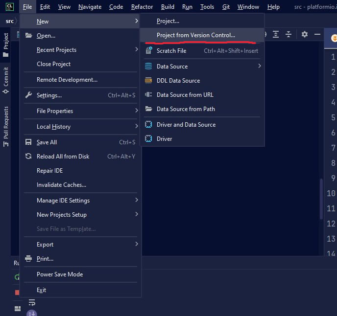
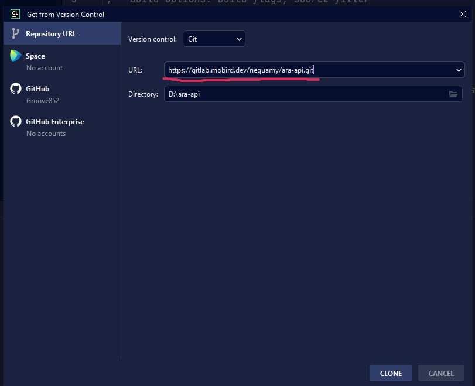

# Как работать с созданием документации через SPHINX?

## Начало работы


В самом начале, перед написанием документации, необходимо склонировать к себе данный репозиторий с помощью трех вариантов:

### 1. Скачивание архива из репозитория:


### 2. Клонирование репозитория

```bash
foo@bar:~$ git clone https://gitlab.mobird.dev/nequamy/ara-api.git --branch=feature/docs
```

### 3. Установка с помощью Version Control в продуктах Jetbrains

1) Выбираем создание нового проекта их системы контроля версий (git)



2) Указываем ссылку на архив и расположения файла



3) Открываем команду и вбиваем команду:

- Ubuntu:
```bash
foo@bar:~/ara-api$ git checkout feature/docs
```
- Windows:
```powershell
PS: C:\ara-api> git checkout feature/docs
```

## Установка плагинов


Перед началом использования необходимо в корневой папке проекта выполнить команду:
- Ubuntu:
```bash
foo@bar:~/ara-api$ pip install -r requirements.txt
```
- Windows:
```powershell
PS: C:\ara-api> pip install -r requirements.txt
```

## Написание документации

При написании документации, которая находится в папке **source/** следует учитывать основные принципы её создания для сохранения общей идеалогии. Принципы для создания документации:

1) Каждый модуль документации должен быть вынесен в отдельные ветки в виде папки производной от **feature/docs** для удобства совместной работы, но следует учитывать, что черезмерное злоупотребление этим принципом может нарушить удобство процесса создания базовой документации. Пример:

    Допустим нам необходимо описать модуль по настройке дрона ARA EDU, а именно вкладки Ports. В таком случае нам необходимо создать новую ветку **feature/docs/ara-edu/ports** с помощью команды:

    ```bash
    foo@bar:~/ara-api$ git checkout -b feature/docs/ara-edu/ports
    ```

    Затем после создания и перехода в новую ветку необходимо её проинициализировать в удаленном git репозитории с помощью следующей команды:

    ```bash
    foo@bar:~/ara-api$ git push origin feature/docs/ara-edu/ports
    ```

    **Важно!!!** После символа "-b" и после слова "origin" должна быть написана ветка, в которой будет вестись работа и в случае если вам необходимо вести работу над несколькими модулями, то они не должны быть инициализированы одновременно, на git должен лежать только один репозиторий, над которым вы работаете

2) Для успешного написания документации очень важно понимать иеерархию файловой системы. Самым главным файлом в каждом модуле является **index.md**, так как именно он отвечает за подключение всех побочных файлов модуля к общей веб страничке. 
   
   При добавлении нового файла или выноса его в папку необходимо сделать **refactor index.md** и добавить туда новый файл. Поле для всех файлов, которые будут подгружаться к страничке находятся на 11 строчке файла **index.md**

3) При редактировании и создании файлов Markdown нужно учитывать что каждый заголовок будет отображен в качестве отдельной подпапки для навигации
4) Все изображения и отдельные файлы, которые должны подгружаться в Markdown должны быть вынесены в отдельную папку под названием **images** в модуле, над которым вы ведете работу в данный момент

## Создание документации

Для того чтобы посмотреть как выглядит текущая документация по тому модулю, который вы описываете в данный момент, нужно выполнить сборку документации. Сборка выполняется с помощью простой команды из корневой папки проекта:

```bash
foo@bar:~/ara-api$ make html
```

Скомпилированный после этой команды html находится в папке **/build**. Для его просмотра, как и для любого другого html необходимо открыть его через системный проводник или же из IDE открыть его с помощью любого веб браузера.

После перекомпиляции html можно не проводить снова открытие файла через браузер, так как можно просто обновить веб страничку и скомпилированные изменения сразу же вступят в силу.

#### Пример документации

https://github.com/wagtail/wagtail/tree/main/docs
